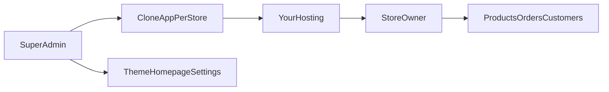

# White-label boxed product plan

Master plan for this site. Saved from the Cursor plan so it lives with the repo.

## Decisions (locked)

- **Model:** white-label boxed product — one codebase, one isolated install per store (own database, `.env`, uploads). Not multi-tenant SaaS.
- **Money:** setup fee + monthly support (hosting included in support).
- **Design:** super admin picks and edits themes. Store owner never sees Themes.
- **Hosting:** you run domain, SSL, and cPanel or VPS.
- **Themes:** a small catalog of full storefront styles (organic, gadget, later fashion/general). Same catalog, cart, and checkout — only Blade/CSS change.

## What exists today

- Single role `admin` on all `/admin` routes in `routes/admin.php` (`role:admin`).
- Login sends `admin` to the dashboard (`app/Http/Controllers/Auth/LoginController.php`).
- Seed only creates `admin` (`database/seeders/AdminSeeder.php`). Permissions exist but routes do not use them.
- Themes UI is commented out in `resources/views/admin/partials/sidebar.blade.php`, but `ThemeController` routes still work if you know the URL.
- Two themes: `organic-v1` (complete enough) and `gadget-v1` (many pages fall back to default views).
- Store settings, homepage, and colors are already editable — that is the safe theme-edit layer.

## Owner vs super admin

- **Store owner:** dashboard, products, categories (optional), orders, customers, messages, reports.
- **Super admin only:** Themes, Site Setting (homepage / pages / banners), Settings (payment, shipping, SEO, colors), theme activate/delete.
- Keep the existing `admin` role mapped to `super_admin` so current logins do not break.

## Implementation order

1. **Roles** — add `super_admin` + `store_owner`; allow both into `/admin`; hide/block design routes for owner; update login + seeder.
2. **Gadget theme complete** — shop, product, cart, checkout, thank-you, about, contact so electronics/cover stores are sellable.
3. **2–3 presets** — grocery, gadget, fashion: default categories + homepage copy (not a new repo).
4. **Onboarding** — follow the checklist; first 5 stores stay manual (no installer yet).
5. **Later** — fashion theme, backup/update routine, installer, license/domain lock, internal client sheet tool.

**Out of scope until you choose it:** multi-tenant one-database SaaS, owner self-serve signup, cPanel auto-deploy API.

## First coding slice (Phase 1)

- Seeder: `super_admin`, `store_owner`, permissions (`manage-design`, `manage-settings`, keep product/order ones).
- Middleware: both roles can open `/admin`; design/settings routes require `super_admin`.
- Sidebar: wrap Site Setting + Settings + Themes in `@role('super_admin')`.
- Owner hitting those URLs: 403.
- Existing `admin@example.com` / live admin users: assign `super_admin`.
